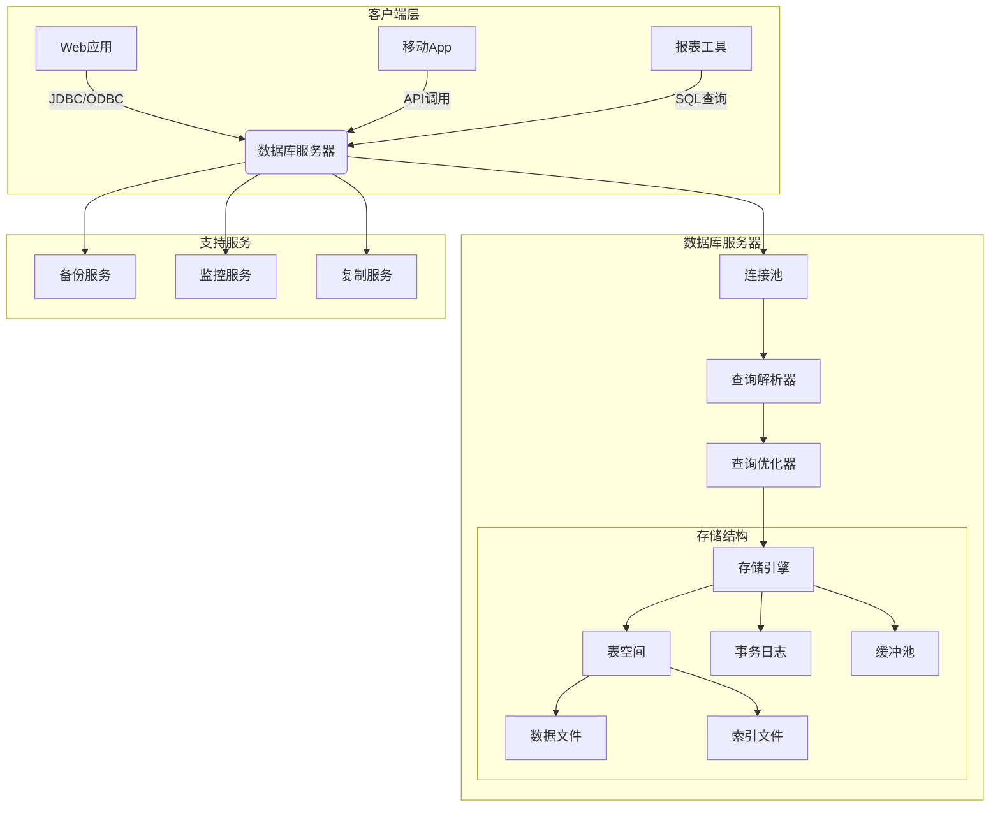
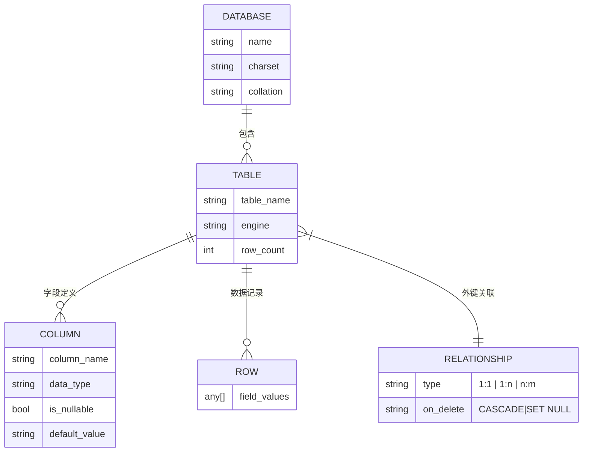

# 数据库相关概念

+ 数据库管理系统
+ 关系型
+ SQL
  结构化查询语言 Structured Query Language

## MySQL

### 下载 配置 卸载

+ 下载登录完毕，之后需要再查吧
+ 删除卸载，再说......

### 数据模型

+ 关系型：多张能互相连接的二维表组成的数据库




+ 数据关系：
  ```mermaid
  erDiagram
      DATABASE ||--o{ TABLE : contains
      TABLE ||--o{ COLUMN : has
      TABLE ||--o{ ROW : contains
      TABLE ||--|{ CONSTRAINT : enforces



### SQL通用语法

+ 可以单行或多行书写，以分号结尾
+ SQL语句不分大小写，关键字建议使用大写
+ 注释：
  + 单行： -- or #
  + 多行 /* */

+ e.g.
  ```mysql
  mysql> show databases;
  +--------------------+
  | Database           |
  +--------------------+
  | information_schema |  -- 视图，无实际文件
  | mysql              |  -- 核心信息
  | performance_schema |  -- 性能
  | sys                |  -- 系统
  +--------------------+  -- 这四个一般不改动
  4 rows in set (0.01 sec)
  ```

  

### SQL分类：

+ DDL：数据定义语言，操作数据库
+ DML：数据操作语言，增删改
+ DQL：数据查询语言，查
+ DCL：数据控制语言，权限控制

### MySQL数据类型

| 类别       | 数据类型     | 存储空间      | 范围/格式                                | 用途说明               |
| :--------- | :----------- | :------------ | :--------------------------------------- | :--------------------- |
| **整数**   | TINYINT      | 1字节         | -128~127 (有符号), 0~255 (无符号)        | 小范围数值如状态码     |
|            | SMALLINT     | 2字节         | -32768~32767, 0~65535                    | 中等范围数值           |
|            | MEDIUMINT    | 3字节         | -8.3M~8.3M, 0~16.7M                      |                        |
|            | INT          | 4字节         | -2.1B~2.1B, 0~4.2B                       | 最常用的整数类型       |
|            | BIGINT       | 8字节         | -9.2E18~9.2E18, 0~1.8E19                 | 大整数如自增主键       |
| **小数**   | FLOAT        | 4字节         | 约7位精度                                | 非精确计算             |
|            | DOUBLE       | 8字节         | 约15位精度                               | 科学计算               |
|            | DECIMAL(M,D) | 变长(M+2字节) | 精确计算，M=总位数(1~65)，D=小数位(0~30) | 金融金额               |
| **字符串** | CHAR(N)      | 定长N字节     | 最大255字符                              | 固定长度如MD5/UUID     |
|            | VARCHAR(N)   | 变长(长度+1)  | 最大65,535字节(实际约16K)                | 变长文本               |
|            | TEXT         | 变长(长度+2)  | 最大65KB                                 | 文章内容等中等文本     |
|            | LONGTEXT     | 变长(长度+4)  | 最大4GB                                  | 超大文本               |
| **二进制** | BINARY(N)    | 定长N字节     | 最大255字节                              | 二进制标识             |
|            | VARBINARY(N) | 变长(长度+1)  | 最大65KB                                 | 可变二进制数据         |
|            | BLOB         | 变长(长度+2)  | 最大65KB                                 | 图片/文件等二进制存储  |
| **日期**   | DATE         | 3字节         | 1000-01-01~9999-12-31                    | 日期存储               |
|            | TIME         | 3字节         | -838:59:59~838:59:59                     | 时间值                 |
|            | DATETIME     | 8字节         | 1000-01-01 00:00:00~9999-12-31 23:59:59  | 日期时间(不受时区影响) |
|            | TIMESTAMP    | 4字节         | 1970-01-01~2038-01-19 (带时区转换)       | 自动更新时间戳         |
| **其他**   | ENUM         | 1-2字节       | 最多65,535个预定义值                     | 单选值如性别           |
|            | SET          | 1-8字节       | 最多64个成员                             | 多选值如标签           |
|            | JSON         | 变长          | 最大1GB (MySQL 5.7+)                     | 结构化数据存储         |

+ 使用
  ```mysql
  age int
  score double(x, y) -- x:总长度 0 ~ 100 , y:小数点后面保留的位数 2
  score double (5, 2)
  birthday date
  name char(x) -- x:最大存储字符数, 定长，不足处用空格填充，存储性能高，浪费空间
  name varchar(x) -- x:最大存储字符数，存储性能低，节约空间
  ```

  

### DDL

#### 操作库

1. 查询：见上

2. 创建：
   ```mysql
   mysql> create database db1;  -- 创建数据库
   Query OK, 1 row affected (0.01 sec)
   
   mysql> show databases;
   +--------------------+
   | Database           |
   +--------------------+
   | db1                |  -- 新增数据库db1
   | information_schema |
   | mysql              |
   | performance_schema |
   | sys                |
   +--------------------+
   5 rows in set (0.00 sec)
   ```

   + 优化版本：

   ```mysql
   mysql> create database if not exists db2
   ```

3. 删除：

   ```mysql
   mysql> drop database db1;  -- 删除语法
   Query OK, 0 rows affected (0.01 sec)
   
   mysql> show databases;
   +--------------------+
   | Database           |
   +--------------------+
   | information_schema |
   | mysql              |
   | performance_schema |
   | sys                |
   +--------------------+
   4 rows in set (0.00 sec)
   ```

   + 优化版本：

   ```mysql
   mysql> drop database if exists db2
   ```

4. 使用：
   ```mysql
   mysql> use db1;  -- 使用db1
   Database changed
   mysql> select database();  -- 查询现在使用的数据库
   +------------+
   | database() |
   +------------+
   | db1        |
   +------------+
   1 row in set (0.00 sec)
   ```

   

#### 操作表

1. 查询：
   ```mysql
   mysql> show tables;  -- 查看具体表
   +------------------------------------------------------+
   | Tables_in_mysql                                      |
   +------------------------------------------------------+
   | columns_priv                                         |
   | component                                            |
   | db                                                   |
   | default_roles                                        |
   | engine_cost                                          |
   | func                                                 |
   | general_log                                          |
   | global_grants                                        |
   | gtid_executed                                        |
   | help_category                                        |
   | help_keyword                                         |
   | help_relation                                        |
   | help_topic                                           |
   | innodb_index_stats                                   |
   | innodb_table_stats                                   |
   | ndb_binlog_index                                     |
   | password_history                                     |
   | plugin                                               |
   | procs_priv                                           |
   | proxies_priv                                         |
   | replication_asynchronous_connection_failover         |
   | replication_asynchronous_connection_failover_managed |
   | replication_group_configuration_version              |
   | replication_group_member_actions                     |
   | role_edges                                           |
   | server_cost                                          |
   | servers                                              |
   | slave_master_info                                    |
   | slave_relay_log_info                                 |
   | slave_worker_info                                    |
   | slow_log                                             |
   | tables_priv                                          |
   | time_zone                                            |
   | time_zone_leap_second                                |
   | time_zone_name                                       |
   | time_zone_transition                                 |
   | time_zone_transition_type                            |
   | user                                                 |
   +------------------------------------------------------+
   38 rows in set (0.00 sec)
   
   mysql> desc func;  -- 查看表的具体结构
   +-------+------------------------------+------+-----+---------+-------+
   | Field | Type                         | Null | Key | Default | Extra |
   +-------+------------------------------+------+-----+---------+-------+
   | name  | char(64)                     | NO   | PRI |         |       |
   | ret   | tinyint                      | NO   |     | 0       |       |
   | dl    | char(128)                    | NO   |     |         |       |
   | type  | enum('function','aggregate') | NO   |     | NULL    |       |
   +-------+------------------------------+------+-----+---------+-------+
   4 rows in set (0.00 sec)
   
   ```

2. 创建：
   ```mysql
   mysql> create table tb_user( -- 表名
       -> id int,  -- 数据名字 数据类型
       -> username varchar(20), -- varchar（20）代表不超过20的字符串
       -> password varchar(32)
       -> );
   Query OK, 0 rows affected (0.04 sec)
   
   mysql> show tables;
   +---------------+
   | Tables_in_db1 |
   +---------------+
   | tb_user       |
   +---------------+
   1 row in set (0.00 sec)
   
   mysql> desc tb_user;
   +----------+-------------+------+-----+---------+-------+
   | Field    | Type        | Null | Key | Default | Extra |
   +----------+-------------+------+-----+---------+-------+
   | id       | int         | YES  |     | NULL    |       |
   | username | varchar(20) | YES  |     | NULL    |       |
   | password | varchar(32) | YES  |     | NULL    |       |
   +----------+-------------+------+-----+---------+-------+
   3 rows in set (0.00 sec)
   ```

+ 案例：创建学生表
  ```mysql
  mysql> create table student(
      -> id int,
      -> name varchar(10),
      -> gender char(1),
      -> birthday date,
      -> score double(5,2),
      -> email varchar(64),
      -> tel varchar(15),
      -> status tinyint
      -> );
  Query OK, 0 rows affected, 1 warning (0.03 sec)
  
  mysql> desc student;
  +----------+-------------+------+-----+---------+-------+
  | Field    | Type        | Null | Key | Default | Extra |
  +----------+-------------+------+-----+---------+-------+
  | id       | int         | YES  |     | NULL    |       |
  | name     | varchar(10) | YES  |     | NULL    |       |
  | gender   | char(1)     | YES  |     | NULL    |       |
  | birthday | date        | YES  |     | NULL    |       |
  | score    | double(5,2) | YES  |     | NULL    |       |
  | email    | varchar(64) | YES  |     | NULL    |       |
  | tel      | varchar(15) | YES  |     | NULL    |       |
  | status   | tinyint     | YES  |     | NULL    |       |
  +----------+-------------+------+-----+---------+-------+
  8 rows in set (0.00 sec)
  ```

3. 删除表：

   + 删除表

   + 判断是否存在再删除
     ```mysql
     mysql> drop table if exists tb_user;
     ```

4. 修改表(上述student表为例）：

   + 修改表名
     ```mysql
     mysql> alter table student rename to stu;
     Query OK, 0 rows affected (0.03 sec)
     
     mysql> show tables;
     +---------------+
     | Tables_in_db1 |
     +---------------+
     | stu           | -- 
     +---------------+
     1 row in set (0.00 sec)
     ```

     

   + 添加一列
     ```mysql
     mysql> alter table stu add address varchar(50);
     Query OK, 0 rows affected (0.05 sec)
     Records: 0  Duplicates: 0  Warnings: 0
     
     mysql> desc stu;
     +----------+-------------+------+-----+---------+-------+
     | Field    | Type        | Null | Key | Default | Extra |
     +----------+-------------+------+-----+---------+-------+
     | id       | int         | YES  |     | NULL    |       |
     | name     | varchar(10) | YES  |     | NULL    |       |
     | gender   | char(1)     | YES  |     | NULL    |       |
     | birthday | date        | YES  |     | NULL    |       |
     | score    | double(5,2) | YES  |     | NULL    |       |
     | email    | varchar(64) | YES  |     | NULL    |       |
     | tel      | varchar(15) | YES  |     | NULL    |       |
     | status   | tinyint     | YES  |     | NULL    |       |
     | address  | varchar(50) | YES  |     | NULL    |       | -- 
     +----------+-------------+------+-----+---------+-------+
     9 rows in set (0.00 sec)
     ```

     

   + 修改数据类型
     ```mysql
     mysql> alter table stu modify address char(50);
     Query OK, 0 rows affected (0.08 sec)
     Records: 0  Duplicates: 0  Warnings: 0
     
     mysql> desc stu;
     +----------+-------------+------+-----+---------+-------+
     | Field    | Type        | Null | Key | Default | Extra |
     +----------+-------------+------+-----+---------+-------+
     | id       | int         | YES  |     | NULL    |       |
     | name     | varchar(10) | YES  |     | NULL    |       |
     | gender   | char(1)     | YES  |     | NULL    |       |
     | birthday | date        | YES  |     | NULL    |       |
     | score    | double(5,2) | YES  |     | NULL    |       |
     | email    | varchar(64) | YES  |     | NULL    |       |
     | tel      | varchar(15) | YES  |     | NULL    |       |
     | status   | tinyint     | YES  |     | NULL    |       |
     | address  | char(50)    | YES  |     | NULL    |       | -- 
     +----------+-------------+------+-----+---------+-------+
     9 rows in set (0.00 sec)
     ```

     

   + 修改列名和数据类型
     ```mysql
     mysql> alter table stu change address addr varchar(30);
     Query OK, 0 rows affected (0.08 sec)
     Records: 0  Duplicates: 0  Warnings: 0
     
     mysql> desc stu;
     +----------+-------------+------+-----+---------+-------+
     | Field    | Type        | Null | Key | Default | Extra |
     +----------+-------------+------+-----+---------+-------+
     | id       | int         | YES  |     | NULL    |       |
     | name     | varchar(10) | YES  |     | NULL    |       |
     | gender   | char(1)     | YES  |     | NULL    |       |
     | birthday | date        | YES  |     | NULL    |       |
     | score    | double(5,2) | YES  |     | NULL    |       |
     | email    | varchar(64) | YES  |     | NULL    |       |
     | tel      | varchar(15) | YES  |     | NULL    |       |
     | status   | tinyint     | YES  |     | NULL    |       |
     | addr     | varchar(30) | YES  |     | NULL    |       | -- 
     +----------+-------------+------+-----+---------+-------+
     9 rows in set (0.00 sec)
     ```

     

   + 删除列
     ```mysql
     mysql> alter table stu drop addr;
     Query OK, 0 rows affected (0.06 sec)
     Records: 0  Duplicates: 0  Warnings: 0
     
     mysql> desc stu;
     +----------+-------------+------+-----+---------+-------+
     | Field    | Type        | Null | Key | Default | Extra |
     +----------+-------------+------+-----+---------+-------+
     | id       | int         | YES  |     | NULL    |       |
     | name     | varchar(10) | YES  |     | NULL    |       |
     | gender   | char(1)     | YES  |     | NULL    |       |
     | birthday | date        | YES  |     | NULL    |       |
     | score    | double(5,2) | YES  |     | NULL    |       |
     | email    | varchar(64) | YES  |     | NULL    |       |
     | tel      | varchar(15) | YES  |     | NULL    |       |
     | status   | tinyint     | YES  |     | NULL    |       |
     +----------+-------------+------+-----+---------+-------+
     8 rows in set (0.00 sec) -- 
     ```

     

   

